# 🌐 Browser Automation Benchmark

**The definitive comparison of browser automation tools for AI agents**

A comprehensive benchmark suite comparing **browser-use**, **dev3000**, **firecrawl**, **playwriter**, and **playwright-mcp** across real-world scenarios with measurable metrics including token usage, execution time, and quality of results.

---

## 📊 Quick Comparison

| Tool | Primary Purpose | Best For | Language | MCP Support |
|------|-----------------|----------|----------|-------------|
| **[browser-use](https://github.com/browser-use/browser-use)** | AI Browser Agent | End-to-end browser automation with LLM reasoning | Python | ✅ Server |
| **[dev3000](https://github.com/vercel-labs/dev3000)** | Debugging Assistant | Capturing logs, errors, and screenshots during development | TypeScript | ✅ Server |
| **[firecrawl](https://github.com/firecrawl/firecrawl)** | Web Scraping API | Converting websites to LLM-ready markdown/structured data | TypeScript | ✅ [Separate](https://github.com/firecrawl/firecrawl-mcp-server) |
| **[playwriter](https://github.com/remorses/playwriter)** | MCP Browser Control | Full Playwright API via single `execute` tool | TypeScript | ✅ Client |
| **[playwright-mcp](https://github.com/microsoft/playwright-mcp)** | MCP Browser Control | Structured browser automation via accessibility tree | TypeScript | ✅ Server |

---

## 🔬 Feature Comparison

### Core Capabilities

| Feature | browser-use | dev3000 | firecrawl | playwriter | playwright-mcp |
|---------|:-----------:|:-------:|:---------:|:----------:|:--------------:|
| **Web Scraping** | ✅ | ⚠️ Limited | ✅ Excellent | ✅ | ✅ |
| **Navigation & Clicks** | ✅ | ✅ | ⚠️ Actions | ✅ | ✅ |
| **Form Filling** | ✅ | ✅ | ⚠️ Actions | ✅ | ✅ |
| **Screenshot Capture** | ✅ | ✅ Auto | ✅ | ✅ | ✅ |
| **Console Log Capture** | ✅ | ✅ Excellent | ❌ | ✅ | ✅ |
| **Network Request Logging** | ✅ | ✅ Excellent | ❌ | ✅ | ✅ |
| **PDF Generation** | ✅ | ❌ | ❌ | ✅ | ✅ Opt-in |
| **Structured Data Extraction** | ✅ | ❌ | ✅ Excellent | ✅ | ✅ |
| **Authentication Handling** | ✅ | ✅ | ✅ | ✅ | ✅ |
| **CAPTCHA Handling** | ✅ Cloud | ❌ | ✅ Cloud | ⚠️ Manual | ❌ |

### Browser & Runtime

| Feature | browser-use | dev3000 | firecrawl | playwriter | playwright-mcp |
|---------|:-----------:|:-------:|:---------:|:----------:|:--------------:|
| **Browser Engine** | Chromium (CDP) | Chrome (CDP + Extension) | Headless browsers | Chrome (Extension) | Chromium/Firefox/WebKit |
| **Headless Mode** | ✅ | ✅ | ✅ | ❌ Uses real browser | ✅ |
| **Persistent Profile** | ✅ | ✅ | N/A | ✅ Reuses yours | ✅ |
| **Multiple Tabs** | ✅ | ✅ | N/A | ✅ | ✅ |
| **Proxy Support** | ✅ | ❌ | ✅ | ✅ | ✅ |
| **Cloud Hosting** | ✅ Browser Use Cloud | ❌ | ✅ Firecrawl Cloud | ❌ | ❌ |

### LLM Integration

| Feature | browser-use | dev3000 | firecrawl | playwriter | playwright-mcp |
|---------|:-----------:|:-------:|:---------:|:----------:|:--------------:|
| **Native LLM Support** | ✅ Multi-provider | Via MCP | API-based | Via MCP | Via MCP |
| **Vision/Screenshots to LLM** | ✅ | ✅ | ✅ | ✅ Accessibility snapshots | ⚠️ Opt-in |
| **Context Window Efficiency** | Medium | Medium | High | High (90% less) | High |
| **Custom System Prompts** | ✅ | ❌ | N/A | ✅ | ❌ |
| **Tool Count** | Many actions | 5 tools | API endpoints | 1 tool (`execute`) | 20+ tools |

### Developer Experience

| Feature | browser-use | dev3000 | firecrawl | playwriter | playwright-mcp |
|---------|:-----------:|:-------:|:---------:|:----------:|:--------------:|
| **Setup Complexity** | Medium | Easy | Easy (API key) | Easy | Easy |
| **Documentation** | ✅ Excellent | ✅ Good | ✅ Excellent | ✅ Good | ✅ Excellent |
| **TypeScript Support** | ❌ Python only | ✅ Native | ✅ SDK available | ✅ Native | ✅ Native |
| **Python Support** | ✅ Native | ❌ | ✅ SDK available | ❌ | ❌ |
| **Open Source** | ✅ | ✅ | ✅ AGPL-3.0 | ✅ | ✅ |

---

## 🏗️ Architecture Comparison

### How Each Tool Works

```mermaid
flowchart TB
    subgraph BrowserUse["browser-use"]
        BU_LLM[LLM Provider] --> BU_Agent[Agent]
        BU_Agent --> BU_DOM[DOM Service]
        BU_DOM --> BU_CDP[CDP Client]
        BU_CDP --> BU_Browser[Chromium]
    end

    subgraph Dev3000["dev3000"]
        D3_CLI[CLI] --> D3_Server[Dev Server Monitor]
        D3_Server --> D3_Browser[Headless Browser]
        D3_Browser --> D3_Extension[Chrome Extension]
        D3_Server --> D3_MCP[MCP Server]
        D3_MCP --> D3_Claude[Claude Code]
    end

    subgraph Firecrawl["firecrawl"]
        FC_API[REST API] --> FC_Crawler[Crawler Engine]
        FC_Crawler --> FC_Browser[Headless Browsers]
        FC_Browser --> FC_Parser[Content Parser]
        FC_Parser --> FC_Output[Markdown/JSON]
    end

    subgraph Playwriter["playwriter"]
        PW_MCP[MCP Client] --> PW_WS[WebSocket Server]
        PW_WS --> PW_Extension[Chrome Extension]
        PW_Extension --> PW_CDP[chrome.debugger API]
        PW_CDP --> PW_Tabs[Browser Tabs]
    end

    subgraph PlaywrightMCP["playwright-mcp"]
        PM_MCP[MCP Client] --> PM_Server[MCP Server]
        PM_Server --> PM_PW[Playwright]
        PM_PW --> PM_Browser[Browser]
        PM_Browser --> PM_A11y[Accessibility Tree]
    end
```



### Interaction Model Comparison

| Aspect | browser-use | dev3000 | firecrawl | playwriter | playwright-mcp |
|--------|-------------|---------|-----------|------------|----------------|
| **Input** | Task description | "fix my app" | URL + options | Playwright code | Element refs |
| **Processing** | LLM decides actions | Analyzes logs | Crawls & parses | Executes code | Accessibility tree |
| **Output** | Task completion | Fix suggestions | Markdown/JSON | Execution result | Structured data |
| **Feedback Loop** | Yes, multi-step | Yes, via MCP | No | Yes | Yes |

---

## 📈 Benchmark Results

### Test Environment
- **Machine**: Apple Silicon / x86_64
- **Runtime**: Bun 1.x / Node.js 22+
- **Token Tracking**: [ccusage](https://ccusage.com/guide/)
- **LLM**: [Claude Opus 4.5](https://platform.claude.com/docs/en/about-claude/models/overview) (via Claude Code)

### Token Pricing Reference

All benchmark costs calculated using [Anthropic's official pricing](https://platform.claude.com/docs/en/about-claude/models/overview):

| Model | Input (per 1M tokens) | Output (per 1M tokens) |
|-------|----------------------:|------------------------:|
| **Claude Opus 4.5** | $5.00 | $25.00 |
| Claude Sonnet 4.5 | $3.00 | $15.00 |
| Claude Haiku 4.5 | $1.00 | $5.00 |

### Scenario 1: Web Scraping
**Task**: Extract top 5 Hacker News stories (title, points, author, URL)

| Tool | Tokens Used | Time (s) | Success | Quality |
|------|-------------|----------|---------|---------|
| browser-use | TBD | TBD | TBD | TBD |
| dev3000 | N/A | N/A | N/A | N/A |
| firecrawl | TBD | TBD | TBD | TBD |
| playwriter | TBD | TBD | TBD | TBD |
| playwright-mcp | TBD | TBD | TBD | TBD |

### Scenario 2: Navigation & Interaction
**Task**: Navigate to a site, click through 3 pages, capture final state

| Tool | Tokens Used | Time (s) | Success | Quality |
|------|-------------|----------|---------|---------|
| browser-use | TBD | TBD | TBD | TBD |
| dev3000 | TBD | TBD | TBD | TBD |
| firecrawl | N/A | N/A | N/A | N/A |
| playwriter | TBD | TBD | TBD | TBD |
| playwright-mcp | TBD | TBD | TBD | TBD |

### Scenario 3: Debugging & Log Capture
**Task**: Load page with JS errors, capture and report all errors

| Tool | Tokens Used | Time (s) | Errors Found | Log Completeness |
|------|-------------|----------|--------------|------------------|
| browser-use | TBD | TBD | TBD | TBD |
| dev3000 | TBD | TBD | TBD | TBD |
| firecrawl | N/A | N/A | N/A | N/A |
| playwriter | TBD | TBD | TBD | TBD |
| playwright-mcp | TBD | TBD | TBD | TBD |

### Scenario 4: Form Filling
**Task**: Fill multi-field contact form with validation

| Tool | Tokens Used | Time (s) | Fields Correct | Validation Handled |
|------|-------------|----------|----------------|-------------------|
| browser-use | TBD | TBD | TBD | TBD |
| dev3000 | TBD | TBD | TBD | TBD |
| firecrawl | N/A | N/A | N/A | N/A |
| playwriter | TBD | TBD | TBD | TBD |
| playwright-mcp | TBD | TBD | TBD | TBD |

### Scenario 5: Web Search
**Task**: Search "weather Tokyo tomorrow", extract the answer

| Tool | Tokens Used | Time (s) | Answer Found | Accuracy |
|------|-------------|----------|--------------|----------|
| browser-use | TBD | TBD | TBD | TBD |
| dev3000 | N/A | N/A | N/A | N/A |
| firecrawl | TBD | TBD | TBD | TBD |
| playwriter | TBD | TBD | TBD | TBD |
| playwright-mcp | TBD | TBD | TBD | TBD |

### Scenario 6: Structured Data Extraction
**Task**: Extract product data into JSON schema

| Tool | Tokens Used | Time (s) | Schema Valid | Data Accuracy |
|------|-------------|----------|--------------|---------------|
| browser-use | TBD | TBD | TBD | TBD |
| dev3000 | N/A | N/A | N/A | N/A |
| firecrawl | TBD | TBD | TBD | TBD |
| playwriter | TBD | TBD | TBD | TBD |
| playwright-mcp | TBD | TBD | TBD | TBD |

---

## 🎯 When to Use Each Tool

### browser-use
**Best for**: Complex, multi-step browser automation tasks requiring LLM reasoning

```python
from browser_use import Agent, ChatBrowserUse

agent = Agent(
    task="Find the cheapest flight from NYC to LA next week",
    llm=ChatBrowserUse(),
)
await agent.run()
```

**Strengths**:
- Native LLM integration with multiple providers
- Sophisticated DOM processing and element detection
- Production-ready with cloud hosting option
- Handles complex, open-ended tasks

**Weaknesses**:
- Python only (no TypeScript/JavaScript)
- Higher token usage due to comprehensive context
- Requires more setup for local development

---

### dev3000
**Best for**: Debugging web applications during development

```bash
pnpm install -g dev3000
dev3000
# Then tell Claude: "fix my app"
```

**Strengths**:
- Automatic screenshot capture on errors
- Comprehensive log aggregation (server + browser + network)
- Timeline view for debugging
- Works with any web framework

**Weaknesses**:
- Focused on debugging, not general automation
- Requires running dev server
- Limited to development environment

---

### firecrawl
**Best for**: Web scraping and converting websites to structured data

```typescript
import Firecrawl from '@mendable/firecrawl-js';

const firecrawl = new Firecrawl({ apiKey: 'fc-YOUR_KEY' });
const doc = await firecrawl.scrape('https://example.com', {
  formats: ['markdown', 'html'],
});
```

**Strengths**:
- Best-in-class web scraping
- LLM-ready output formats (markdown, structured JSON)
- Handles anti-bot measures
- Excellent for RAG pipelines

**Weaknesses**:
- Limited browser interaction (actions are secondary)
- Requires API key / self-hosting
- Not designed for stateful automation

---

### playwriter
**Best for**: Full Playwright control via MCP with minimal context window usage

```typescript
// In MCP execute tool
await page.goto('https://example.com');
await page.locator('button').click();
const data = await page.locator('.content').textContent();
```

**Strengths**:
- 90% less context window than alternatives
- Full Playwright API access
- Works with your existing browser profile
- Bypass automation detection (disconnect/reconnect)

**Weaknesses**:
- Requires Chrome extension
- Single `execute` tool means less structured output
- No headless mode (uses real browser)

---

### playwright-mcp
**Best for**: Structured browser automation with Microsoft's official MCP implementation

```json
{
  "mcpServers": {
    "playwright": {
      "command": "npx",
      "args": ["@playwright/mcp@latest"]
    }
  }
}
```

**Strengths**:
- Official Microsoft implementation
- Accessibility tree for reliable element selection
- Many specialized tools for different actions
- Cross-browser support (Chromium, Firefox, WebKit)

**Weaknesses**:
- More tools = more context window usage
- Less flexible than raw Playwright API
- No cloud hosting option

---

## 🔧 Running the Benchmarks

### Prerequisites

```bash
# Install Bun
curl -fsSL https://bun.sh/install | bash

# Clone this repository
git clone https://github.com/user/browser-automation-benchmark
cd browser-automation-benchmark

# Install dependencies
bun install

# Set up environment variables
cp .env.example .env
# Edit .env with your API keys
```

### Running All Benchmarks

```bash
# Run full benchmark suite
bun run benchmark

# Run specific scenario
bun run benchmark:scraping
bun run benchmark:navigation
bun run benchmark:debugging
bun run benchmark:forms
bun run benchmark:search
bun run benchmark:structured
```

### Viewing Results

Results are automatically saved to `docs/results.md` and can be viewed with:

```bash
bun run results
```

### Token Usage Tracking

This benchmark uses [ccusage](https://ccusage.com/guide/) to track Claude Code token consumption:

```bash
# Install ccusage
bunx ccusage

# View daily usage
bunx ccusage daily

# View session-based usage
bunx ccusage session
```

---

## 📚 Documentation

- [Methodology](docs/methodology.md) - How benchmarks are conducted
- [Results](docs/results.md) - Detailed benchmark results
- [Analysis](docs/analysis.md) - In-depth analysis of each tool

---

## 🤝 Contributing

We welcome contributions! To add a new benchmark scenario or improve existing ones:

1. Fork this repository
2. Create a feature branch
3. Add your scenario in `benchmarks/scenarios/`
4. Update the adapter interfaces if needed
5. Submit a pull request

---

## 📖 References

- [Computer-use vs Browser-use vs Playwright-MCP Comparison (Japanese)](https://zenn.dev/headwaters/articles/7f0717b61848c3)
- [ccusage Documentation](https://ccusage.com/guide/)
- [Model Context Protocol](https://modelcontextprotocol.io/)

---

## 📄 License

MIT License - See [LICENSE](LICENSE) for details.

---

<p align="center">
  <strong>Built with ❤️ for the AI automation community</strong>
</p>
