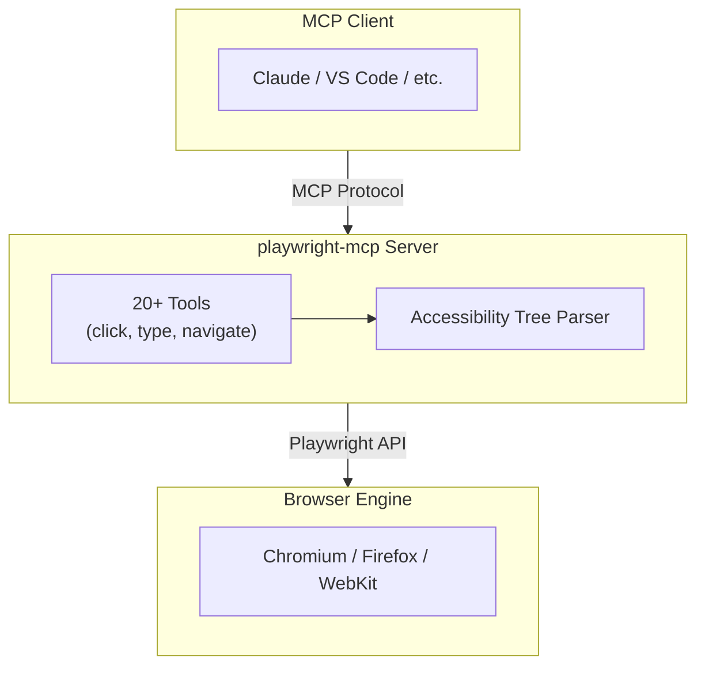
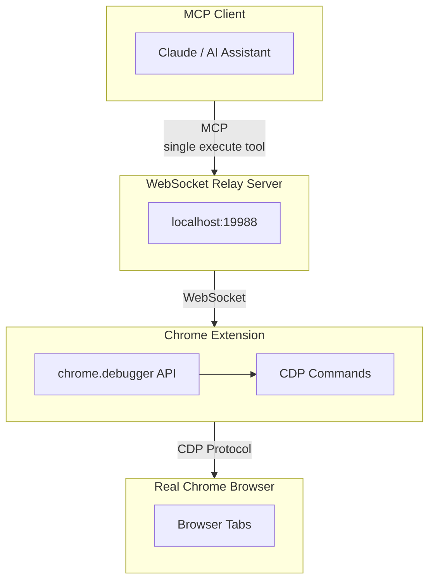
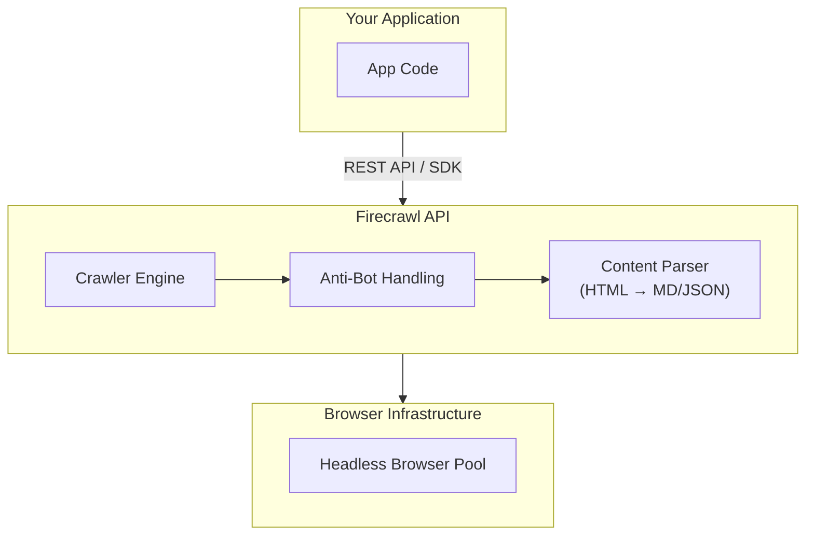
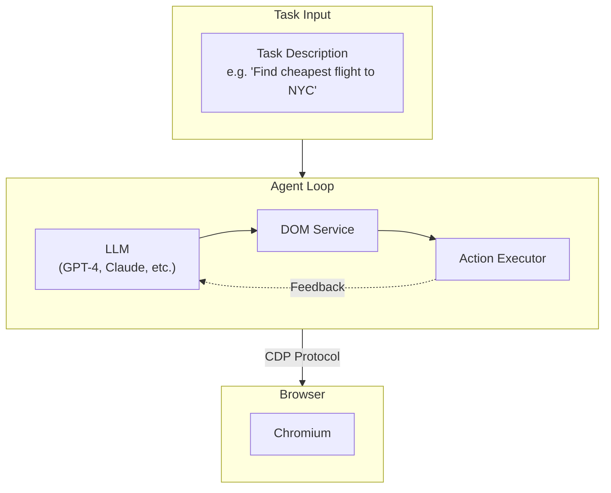
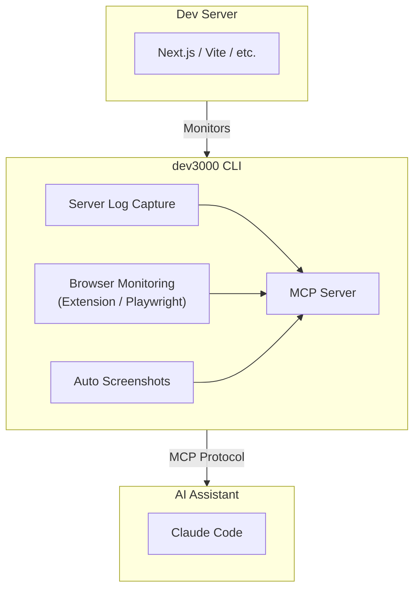
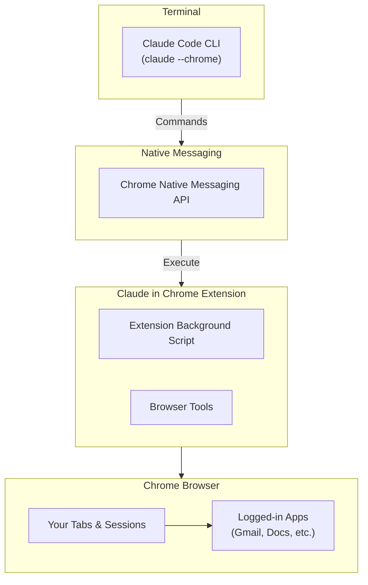
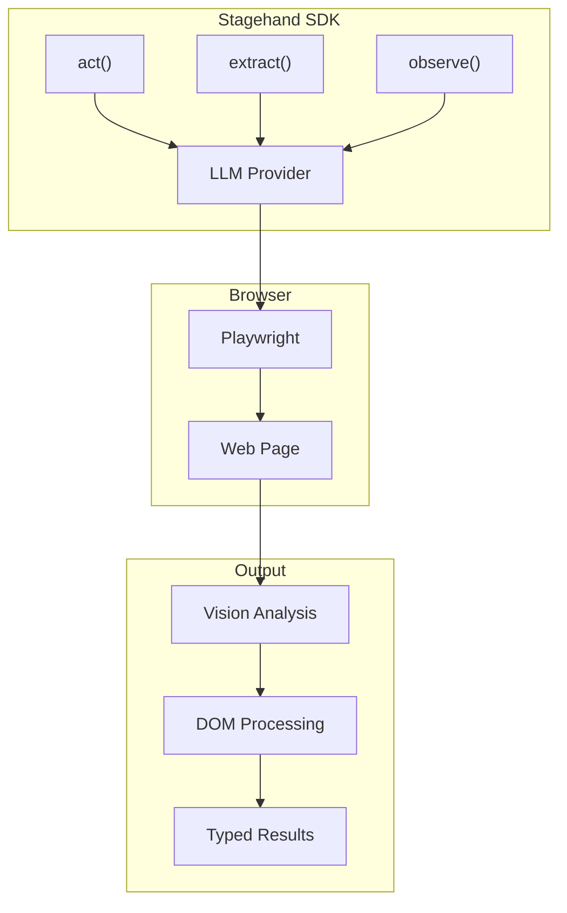
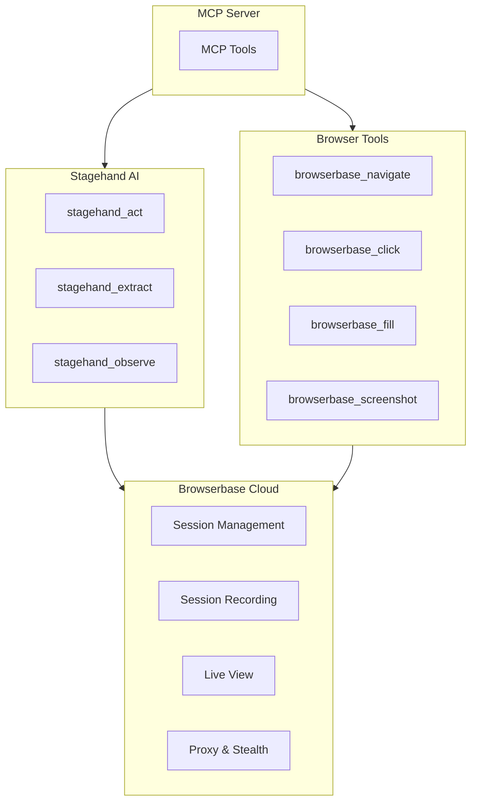

# In-Depth Analysis

This document provides a detailed analysis of each browser automation tool, including their architecture, strengths, weaknesses, and ideal use cases.

## Executive Summary

| Tool | Best For | Avoid When |
|------|----------|------------|
| **playwright-mcp** | Structured automation with reliable element selection | Need minimal context window or raw API access |
| **playwriter** | Full Playwright control with low token usage | Need headless mode or don't want Chrome extension |
| **firecrawl** | Web scraping and RAG pipelines | Need stateful browser interaction |
| **browser-use** | Complex, open-ended AI tasks | Need TypeScript/JavaScript or fast execution |
| **dev3000** | Debugging web apps during development | Need production automation |

---

## playwright-mcp

### Overview

Microsoft's official MCP server for Playwright brings browser automation to AI assistants through the Model Context Protocol. It's designed for reliability and uses Playwright's accessibility tree for element selection.

### Architecture



### Key Features

1. **Accessibility Tree**: Uses ARIA roles and labels instead of CSS selectors
2. **Cross-Browser**: Supports Chromium, Firefox, and WebKit
3. **Granular Tools**: Separate tools for each action type
4. **Official Support**: Maintained by Microsoft/Playwright team

### When to Use

- Building reliable, production-grade automations
- Need cross-browser testing
- Want deterministic element selection
- Prefer structured, well-defined tools

### When to Avoid

- Need minimal context window usage
- Want full Playwright API flexibility
- Need cloud-hosted browsers

### Code Example

```json
// MCP tool call
{
  "tool": "browser_click",
  "arguments": {
    "element": "Submit button",
    "ref": "button[type=submit]"
  }
}
```

---

## playwriter

### Overview

Playwriter takes a different approach: instead of many specialized tools, it exposes the entire Playwright API through a single `execute` tool. This dramatically reduces context window usage while providing maximum flexibility.

### Architecture



### Key Features

1. **Single Tool**: All operations via `execute` with Playwright code
2. **Real Browser**: Works with your actual Chrome, including extensions
3. **Low Context**: 90% less context window than multi-tool approaches
4. **Accessibility Labels**: Vimium-style visual labels for element identification

### When to Use

- Need full Playwright API power
- Want to use existing browser profile
- Working with sites that detect automation
- Context window efficiency is critical

### When to Avoid

- Need headless automation
- Don't want to install Chrome extension
- Prefer structured, guided tools

### Code Example

```javascript
// Single execute call with full Playwright API
await page.goto('https://example.com');
await page.locator('button').filter({ hasText: 'Submit' }).click();
const data = await page.locator('.result').textContent();
return data;
```

---

## firecrawl

### Overview

Firecrawl is fundamentally different from the others: it's a web scraping API, not a browser automation tool. It excels at converting web pages to LLM-ready formats like markdown and structured JSON.

### Architecture



### Key Features

1. **LLM-Ready Output**: Markdown, HTML, structured JSON
2. **Crawling**: Automatically discover and scrape all pages
3. **Map**: Get all URLs from a domain quickly
4. **Extract**: LLM-powered structured data extraction
5. **Anti-Bot**: Handles CAPTCHAs and detection

### When to Use

- Building RAG pipelines
- Need to scrape entire websites
- Want structured data extraction
- Don't need interactive automation

### When to Avoid

- Need to fill forms or interact with pages
- Require real-time browser control
- Building interactive automations

### Code Example

```typescript
const firecrawl = new Firecrawl({ apiKey: 'fc-...' });

// Scrape a page
const doc = await firecrawl.scrape('https://example.com', {
  formats: ['markdown', 'html'],
});

// Extract structured data
const data = await firecrawl.extract({
  urls: ['https://example.com/*'],
  schema: productSchema,
});
```

---

## browser-use

### Overview

Browser-use is an AI-first browser automation agent written in Python. It combines LLM reasoning with browser control to handle complex, open-ended tasks that would be difficult to script manually.

### Architecture



### Key Features

1. **LLM Reasoning**: Agent decides what actions to take
2. **Multi-Provider**: OpenAI, Anthropic, Google, and more
3. **Cloud Option**: Browser Use Cloud for production
4. **Custom Tools**: Extend with your own actions
5. **Structured Output**: Pydantic models for results

### When to Use

- Complex, multi-step tasks
- Tasks that require reasoning
- Building AI agents
- Need production-ready solution

### When to Avoid

- Simple, scriptable tasks
- Need TypeScript/JavaScript
- Want minimal token usage
- Speed is critical

### Code Example

```python
from browser_use import Agent, ChatBrowserUse

agent = Agent(
    task="Find the cheapest round-trip flight from NYC to LA next week",
    llm=ChatBrowserUse(),
)

result = await agent.run()
print(result.final_result())
```

---

## dev3000

### Overview

Dev3000 is not a browser automation tool in the traditional sense. It's a debugging assistant that monitors your development server and browser, capturing logs, errors, and screenshots for AI-assisted debugging.

### Architecture



### Key Features

1. **Log Aggregation**: Server, browser, and network logs in one place
2. **Auto Screenshots**: Captures screenshots on errors and navigation
3. **MCP Tools**: `fix_my_app`, `execute_browser_action`, `crawl_app`
4. **Timeline View**: Visual debugging at `localhost:3684/logs`
5. **Framework Agnostic**: Works with any web framework

### When to Use

- Debugging web app issues
- Want AI-assisted error analysis
- Need comprehensive logging
- Development environment

### When to Avoid

- Production automation
- Need general browser control
- Building scraping pipelines
- Non-development scenarios

### Code Example

```bash
# Start dev3000
pnpm install -g dev3000
dev3000

# Tell Claude
"fix my app"
```

---

## claude-code-chrome

### Overview

Claude Code's Chrome integration is Anthropic's native browser automation solution, letting you control Chrome directly from the terminal using natural language. It connects via the Claude in Chrome extension and uses your existing browser session.

### Architecture



### Key Features

1. **Natural Language**: Describe tasks in plain English, no code needed
2. **Session Reuse**: Uses your existing logins and browser state
3. **GIF Recording**: Unique ability to record interactions as GIFs
4. **Authenticated Apps**: Access Google Docs, Gmail, Notion without APIs
5. **Live Debugging**: Read console logs and debug in real-time

### When to Use

- Tasks requiring your logged-in accounts
- Multi-site workflows that need authentication
- Quick automation without writing code
- Recording demos or documentation
- Debugging with AI assistance

### When to Avoid

- Need headless/CI automation
- Require Firefox/Safari support
- Don't have Claude Pro/Team/Enterprise
- Need fully open-source solution

### Code Example

```bash
# Start Claude Code with Chrome
claude --chrome

# Example tasks you can give:
# "Go to news.ycombinator.com and extract the top 5 stories"
# "Fill out the contact form on my-site.com with test data"
# "Record a GIF showing the login flow"
# "Check my Gmail for emails from John and summarize them"
```

---

## stagehand

### Overview

Stagehand is an AI-powered browser automation SDK by Browserbase that uses natural language to control browsers. It provides three core methods: `act()` for actions, `extract()` for structured data extraction, and `observe()` for page state.

### Architecture



### Key Features

1. **Natural Language Actions**: `act({ action: "Click the submit button" })`
2. **Zod Schema Extraction**: Type-safe data extraction with schemas
3. **Multi-model Support**: Works with GPT-4, Claude, and more
4. **Vision Capabilities**: Uses screenshots for element detection
5. **Caching**: Performance optimization for repeated operations

### Code Example

```typescript
import { Stagehand } from "@browserbase/stagehand";
import { z } from "zod";

const stagehand = new Stagehand({ env: "LOCAL" });
await stagehand.init();

// Natural language action
await stagehand.act({ action: "Search for 'AI automation'" });

// Type-safe extraction
const products = await stagehand.extract({
  instruction: "Extract all products",
  schema: z.object({
    items: z.array(z.object({
      name: z.string(),
      price: z.number(),
    })),
  }),
});
```

---

## browserbase-mcp

### Overview

Browserbase MCP Server combines Stagehand's AI capabilities with Browserbase's cloud browser infrastructure. It provides MCP tools for both traditional browser automation and AI-powered interactions.

### Architecture



### Key Features

1. **Cloud Browser Sessions**: No local browser needed
2. **Parallel Sessions**: Scale to many concurrent browsers
3. **Advanced Stealth**: Bypass anti-bot detection
4. **Session Recording**: Automatic recording of all interactions
5. **Live View**: Watch browser sessions in real-time
6. **Stagehand Integration**: Full AI capabilities via MCP

### When to Use

- Large-scale web automation
- Tasks requiring anti-bot bypassing
- Need for session recording/auditing
- Parallel browser operations
- Production deployments without local browser dependencies

---

## Comparison Matrix

### Feature Comparison

| Feature | playwright-mcp | playwriter | firecrawl | browser-use | dev3000 | claude-code | stagehand | browserbase |
|---------|:--------------:|:----------:|:---------:|:-----------:|:-------:|:-----------:|:---------:|:-----------:|
| Browser Control | Full | Full | Limited | Full | Limited | Full | Full | Full |
| Headless Mode | ✅ | ❌ | ✅ | ✅ | ✅ | ❌ | ✅ | ✅ Cloud |
| Cross-Browser | ✅ | ❌ Chrome | N/A | ❌ Chromium | ❌ Chrome | ❌ Chrome | Chromium | Chromium |
| LLM Integration | Via MCP | Via MCP | API | Native | Via MCP | Native | Native | Native |
| Cloud Option | ❌ | ❌ | ✅ | ✅ | ❌ | ❌ | ✅ | ✅ |
| Structured Output | ✅ | ✅ | ✅ | ✅ | ❌ | ✅ | ✅ Zod | ✅ Zod |
| Token Efficiency | Medium | High | N/A | Low | Medium | High | High | High |
| Session Reuse | ❌ | ✅ | N/A | ❌ | ✅ | ✅ | ✅ | ✅ |
| GIF Recording | ❌ | ❌ | ❌ | ❌ | ❌ | ✅ | ❌ | ✅ |
| Live View | ❌ | ❌ | ❌ | ❌ | ❌ | ❌ | ❌ | ✅ |

### Performance Characteristics

| Metric | playwright-mcp | playwriter | firecrawl | browser-use | dev3000 | claude-code | stagehand | browserbase |
|--------|:--------------:|:----------:|:---------:|:-----------:|:-------:|:-----------:|:---------:|:-----------:|
| Setup Complexity | Low | Medium | Low | Medium | Low | Low | Low | Low |
| Execution Speed | Fast | Fast | Fast | Slow | Fast | Medium | Medium | Medium |
| Reliability | High | High | High | Medium | High | High | High | High |
| Flexibility | Medium | High | Low | High | Low | High | High | High |

### Use Case Fit

| Use Case | Best Tool | Alternative |
|----------|-----------|-------------|
| Web Scraping | firecrawl | stagehand |
| Form Automation | playwright-mcp | stagehand |
| E2E Testing | playwright-mcp | playwriter |
| RAG Pipelines | firecrawl | browser-use |
| AI Agents | browser-use | stagehand |
| Debugging | dev3000 | claude-code |
| Low Token Usage | playwriter | firecrawl |
| Authenticated Apps | claude-code | playwriter |
| Recording Demos | claude-code | browserbase |
| Type-safe Extraction | stagehand | firecrawl |
| Cloud Scale | browserbase | firecrawl |
| Anti-bot Bypass | browserbase | firecrawl |

---

## Recommendations

### For Beginners

Start with **stagehand** for a great developer experience with natural language and type-safe extraction. Or use **claude-code-chrome** if you have a Claude subscription - no code required, just describe what you want.

### For AI Agent Developers

Use **browser-use** for complex tasks that require reasoning, or **stagehand** for TypeScript projects with type-safe extraction via Zod schemas.

### For Data Engineers

**Firecrawl** is purpose-built for web scraping. **Stagehand** is excellent if you need AI-powered extraction with Zod schemas for type safety.

### For Web Developers

**Dev3000** integrates naturally into your development workflow. **Stagehand** provides an excellent SDK experience for browser automation in TypeScript projects.

### For Authenticated Workflows

**Claude Code Chrome** excels when you need to interact with apps you're already logged into (Google Docs, Gmail, Notion, etc.) - no API keys required.

### For Production Systems at Scale

**Browserbase MCP** provides cloud browser infrastructure with parallel sessions, stealth mode, and session recording. **Firecrawl Cloud** is excellent for scraping workloads.

### For Type-safe Data Extraction

**Stagehand** with its Zod schema support is the best choice when you need strongly-typed extracted data that integrates seamlessly with TypeScript codebases.

---

## Future Outlook

### Trends to Watch

1. **Context Window Optimization**: Tools like playwriter show the value of minimal context usage
2. **Cloud-Native Solutions**: Hosted browser infrastructure is becoming standard
3. **Hybrid Approaches**: Combining multiple tools for different subtasks
4. **Vision Integration**: Screenshots + accessibility trees for robust element detection

### Tool Evolution

- **playwright-mcp**: Likely to add more advanced features, possibly vision support
- **playwriter**: May add more DevTools integration features
- **firecrawl**: Expanding LLM extraction capabilities
- **browser-use**: Adding more LLM providers and cloud features
- **dev3000**: Deepening IDE integrations
- **claude-code-chrome**: Expanding capabilities as beta matures, potentially adding more browsers
- **stagehand**: Maturing SDK with broader model support and caching improvements
- **browserbase-mcp**: Expanding cloud infrastructure and stealth capabilities

---

## Conclusion

There's no single "best" browser automation tool - each has distinct strengths:

- **playwright-mcp**: Reliability and structure
- **playwriter**: Flexibility and efficiency
- **firecrawl**: Scraping and extraction
- **browser-use**: AI reasoning and complexity
- **dev3000**: Development and debugging
- **claude-code-chrome**: Natural language and authenticated workflows
- **stagehand**: Type-safe extraction and developer experience
- **browserbase-mcp**: Cloud scale and anti-bot bypass

Choose based on your specific needs, and don't hesitate to use multiple tools for different parts of your workflow.
