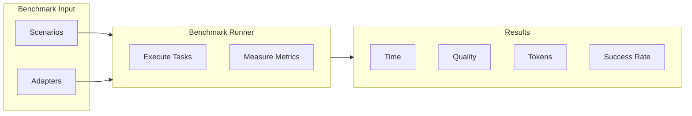
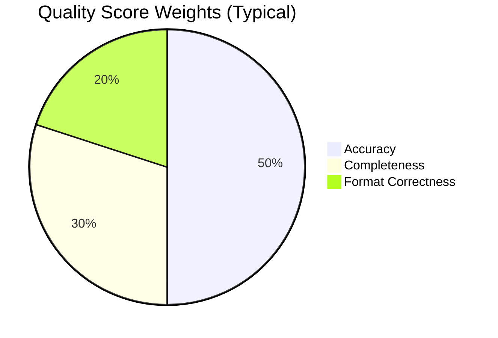
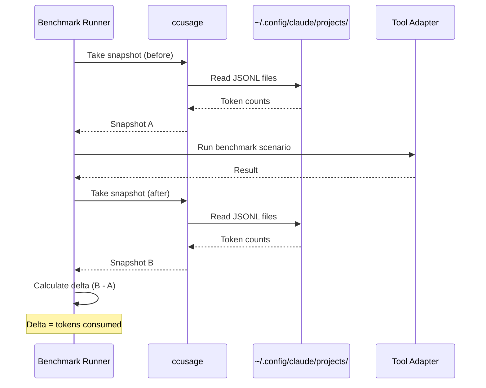

# Benchmark Methodology

This document describes how the Browser Automation Benchmark conducts its evaluations.

## Overview

The benchmark suite evaluates 5 browser automation tools across 6 primary scenarios, measuring:

1. **Execution Time** - How long the task takes to complete
2. **Success Rate** - Whether the task completed without errors
3. **Quality Score** - How accurate and complete the results are
4. **Token Usage** - How many LLM tokens were consumed (when using Claude Code)



## Tools Under Evaluation

| Tool | Type | Primary Interface |
|------|------|-------------------|
| playwright-mcp | MCP Server | 20+ specialized tools |
| playwriter | MCP Client | Single `execute` tool with Playwright API |
| firecrawl | REST API | HTTP endpoints |
| browser-use | Python Library | Agent with LLM reasoning |
| dev3000 | CLI + MCP | Debugging-focused tools |
| claude-code-chrome | CLI + Extension | Natural language commands via `claude --chrome` |
| stagehand | TypeScript SDK | `act()`, `extract()`, `observe()` methods |
| browserbase-mcp | MCP Server | Stagehand tools + cloud browser sessions |

## Benchmark Scenarios

### Scenario 1: Web Scraping

**Objective**: Extract structured data from a web page

**Task**: Extract the top 5 stories from Hacker News with title, URL, points, and author.

**Evaluation Criteria**:
- **Accuracy** (50%): How many items correctly match expected data
- **Completeness** (30%): How many required fields are present
- **Format Correctness** (20%): Whether all items are well-formed

**Test URL**: `https://news.ycombinator.com/`

---

### Scenario 2: Navigation & Interaction

**Objective**: Navigate through multiple pages using clicks and links

**Task**: Start at example.com, click through to IANA, then to IANA home page.

**Evaluation Criteria**:
- **Accuracy** (50%): Did we reach the expected final URL
- **Completeness** (30%): How many intermediate URLs were visited
- **Format Correctness** (20%): All URLs are valid

**Test URLs**: `example.com` → `iana.org/domains/example` → `iana.org`

---

### Scenario 3: Debugging & Log Capture

**Objective**: Capture browser console logs and errors

**Task**: Load pages and capture any errors, warnings, and network requests.

**Evaluation Criteria**:
- **Accuracy** (50%): Number of errors captured vs expected
- **Completeness** (30%): Types of logs captured (console, network, error)
- **Format Correctness** (20%): Errors have proper format

**Test URL**: `https://httpbin.org/html`

---

### Scenario 4: Form Filling

**Objective**: Fill out and submit web forms

**Task**: Fill a multi-field form with name, email, phone, and message.

**Evaluation Criteria**:
- **Accuracy** (40%): Number of fields correctly filled
- **Completeness** (30%): All required fields have values
- **Format Correctness** (30%): Form validation passed, submission successful

**Test URL**: `https://httpbin.org/forms/post`

---

### Scenario 5: Web Search

**Objective**: Perform a web search and extract the answer

**Task**: Search for "weather Tokyo tomorrow" and extract the weather information.

**Evaluation Criteria**:
- **Accuracy** (60%): Answer contains relevant weather information
- **Completeness** (20%): Answer was found
- **Format Correctness** (20%): Results were returned

**Test URL**: `https://www.google.com/` (or adapter's native search)

---

### Scenario 6: Structured Data Extraction

**Objective**: Extract data conforming to a JSON schema

**Task**: Extract book details (title, price, availability, rating) from a product page.

**Evaluation Criteria**:
- **Accuracy** (40%): Data matches expected values
- **Completeness** (30%): Number of schema fields populated
- **Format Correctness** (30%): Output validates against schema

**Test URL**: `https://books.toscrape.com/catalogue/a-light-in-the-attic_1000/index.html`

---

## Quality Score Calculation

Each scenario produces a quality score from 0-100 based on weighted criteria:



**Formula:**
```
Overall Score = (Accuracy × Weight_A) + (Completeness × Weight_C) + (Format × Weight_F)
```

Default weights vary by scenario type but typically:
- Accuracy: 40-60%
- Completeness: 20-30%
- Format Correctness: 20-30%

## Token Usage Tracking

Token usage is tracked using [ccusage](https://ccusage.com/guide/) when running benchmarks via Claude Code.

### How It Works



1. ccusage reads Claude Code's local JSONL files from `~/.config/claude/projects/`
2. Before each benchmark, we take a "snapshot" of current usage
3. After the benchmark, we take another snapshot and calculate the delta
4. The delta represents tokens consumed during the benchmark

### Pricing Reference

Based on [Anthropic's official pricing](https://platform.claude.com/docs/en/about-claude/models/overview):

| Model | Input (per 1M) | Output (per 1M) |
|-------|----------------|-----------------|
| Claude Opus 4.5 | $5.00 | $25.00 |
| Claude Sonnet 4.5 | $3.00 | $15.00 |
| Claude Haiku 4.5 | $1.00 | $5.00 |
| ChatBrowserUse | $0.20 | $2.00 |

**Recommended**: Use **Claude Opus 4.5** (`claude-opus-4-5`) for running benchmarks through Claude Code for best results.

## Fairness Considerations

### Adapter Capabilities

Not all adapters support all scenarios. When an adapter doesn't support a required capability:

- The scenario is skipped for that adapter
- Results show "N/A" instead of a failure
- The adapter is not penalized in overall rankings

### Supported Capabilities by Adapter

| Capability | playwright-mcp | playwriter | firecrawl | browser-use | dev3000 | claude-code | stagehand | browserbase |
|------------|:--------------:|:----------:|:---------:|:-----------:|:-------:|:-----------:|:---------:|:-----------:|
| Navigation | ✅ | ✅ | ⚠️ | ✅ | ✅ | ✅ | ✅ | ✅ |
| Scraping | ✅ | ✅ | ✅ | ✅ | ⚠️ | ✅ | ✅ | ✅ |
| Interaction | ✅ | ✅ | ⚠️ | ✅ | ✅ | ✅ | ✅ | ✅ |
| Forms | ✅ | ✅ | ⚠️ | ✅ | ✅ | ✅ | ✅ | ✅ |
| Screenshots | ✅ | ✅ | ✅ | ✅ | ✅ | ✅ | ✅ | ✅ |
| Console Logs | ✅ | ✅ | ❌ | ✅ | ✅ | ✅ | ✅ | ✅ |
| Network Logs | ✅ | ✅ | ❌ | ✅ | ✅ | ✅ | ⚠️ | ✅ |
| Search | ❌ | ❌ | ✅ | ✅ | ❌ | ✅ | ✅ | ✅ |
| Structured | ✅ | ✅ | ✅ | ✅ | ❌ | ✅ | ✅ Excellent | ✅ Excellent |
| AI Tasks | ❌ | ❌ | ❌ | ✅ | ❌ | ✅ | ✅ | ✅ |
| GIF Recording | ❌ | ❌ | ❌ | ❌ | ❌ | ✅ | ❌ | ✅ |
| Live View | ❌ | ❌ | ❌ | ❌ | ❌ | ❌ | ❌ | ✅ |
| Cloud Sessions | ❌ | ❌ | ✅ | ✅ | ❌ | ❌ | ✅ | ✅ |

### Environment Normalization

All benchmarks run with:
- Same timeout settings (60s default)
- Same viewport size (1280×720)
- Clean browser profiles (no cached state)
- Sequential execution (no parallelism)

### Network Considerations

Some variability is expected due to:
- Network latency to test sites
- Dynamic content on target pages
- Rate limiting from test sites

We recommend running multiple times (`--runs=3`) and averaging results.

## Running the Benchmark

### Basic Usage

```bash
# Run all benchmarks
bun run benchmark

# Run specific scenario
bun run benchmark:scraping

# Run specific adapter
bun run benchmark --adapter=playwright-mcp

# Multiple runs with output
bun run benchmark --runs=3 --output=results.md
```

### Command Line Options

| Option | Description |
|--------|-------------|
| `--scenario=<id>` | Run specific scenario only |
| `--adapter=<name>` | Run specific adapter only |
| `--runs=<n>` | Number of runs per scenario |
| `--output=<path>` | Save results to file |
| `--json` | Output as JSON |
| `--headless` | Run browsers in headless mode |
| `--timeout=<ms>` | Timeout per scenario |
| `--verbose` | Show detailed output |

## Interpreting Results

### Success Rate

A high success rate indicates the adapter can reliably complete the task. Failures may occur due to:
- Missing capabilities
- Timeout exceeded
- Element not found
- Network errors

### Quality Score

Quality scores above 80% indicate excellent performance. Scores between 60-80% indicate good performance with some issues. Below 60% suggests the adapter struggles with the task.

### Token Usage

Lower token usage indicates better efficiency. Consider the trade-off between:
- Token efficiency vs task success
- Single-tool approaches (fewer tokens) vs multi-tool approaches (more control)

### Recommended Interpretation

| Metric | Excellent | Good | Fair | Poor |
|--------|-----------|------|------|------|
| Success Rate | >90% | 70-90% | 50-70% | <50% |
| Quality Score | >80 | 60-80 | 40-60 | <40 |
| Duration | <10s | 10-30s | 30-60s | >60s |

## Limitations

1. **Test Site Stability**: External test sites may change, affecting results
2. **Network Dependency**: Results vary with network conditions
3. **LLM Variability**: AI-based adapters may produce different results each run
4. **Capability Mismatch**: Not all adapters are designed for all tasks
5. **Token Tracking**: Only available when using Claude Code with ccusage

## Contributing

To add a new benchmark scenario:

1. Create a new file in `benchmarks/scenarios/`
2. Implement the `BenchmarkScenario` interface
3. Add to the scenarios index
4. Document the scenario in this file

To improve an existing scenario:

1. Ensure backwards compatibility
2. Update evaluation criteria if needed
3. Document changes in this file
