# Benchmark Results

This document contains the results of running the Browser Automation Benchmark suite.

> **Note**: Results are populated by running the benchmark. Run `bun run benchmark --output=docs/results.md` to update.

```mermaid
flowchart LR
    subgraph Scenarios["📋 Scenarios"]
        S1["Scraping"]
        S2["Navigation"]
        S3["Debugging"]
        S4["Forms"]
        S5["Search"]
        S6["Structured"]
    end
    
    subgraph Tools["🔧 Tools"]
        T1["playwright-mcp"]
        T2["playwriter"]
        T3["firecrawl"]
        T4["browser-use"]
        T5["dev3000"]
    end
    
    subgraph Metrics["📊 Metrics"]
        M1["⏱️ Time"]
        M2["✅ Success"]
        M3["🎯 Quality"]
        M4["🔢 Tokens"]
    end
    
    Scenarios --> Tools
    Tools --> Metrics
```



## Latest Results

**Date**: _Pending benchmark run_

**Configuration**:
- Runs per scenario: 1
- Timeout: 60000ms
- Headless: false

---

## Summary

| Metric | Value |
|--------|-------|
| Total Runs | TBD |
| Success Rate | TBD |
| Average Duration | TBD |
| Average Quality | TBD |

---

## Results by Tool

### playwright-mcp

Microsoft's official Playwright MCP server using accessibility tree.

| Metric | Value |
|--------|-------|
| Success Rate | TBD |
| Average Duration | TBD |
| Average Quality | TBD |

**Strengths**:
- Official Microsoft implementation
- Cross-browser support (Chromium, Firefox, WebKit)
- Deterministic element selection via accessibility tree
- Many specialized tools for different actions

**Limitations**:
- More tools = more context window usage
- No cloud hosting option
- Less flexible than raw Playwright API

---

### playwriter

Chrome extension + MCP with full Playwright API via single `execute` tool.

| Metric | Value |
|--------|-------|
| Success Rate | TBD |
| Average Duration | TBD |
| Average Quality | TBD |

**Strengths**:
- 90% less context window than alternatives
- Full Playwright API access
- Works with existing browser profile
- Can bypass automation detection

**Limitations**:
- Requires Chrome extension
- No headless mode (uses real browser)
- Single tool means less structured output

---

### firecrawl

Web scraping API that converts websites to LLM-ready content.

| Metric | Value |
|--------|-------|
| Success Rate | TBD |
| Average Duration | TBD |
| Average Quality | TBD |

**Strengths**:
- Best-in-class web scraping
- LLM-ready output formats (markdown, JSON)
- Handles anti-bot measures
- Excellent for RAG pipelines

**Limitations**:
- Limited browser interaction
- Requires API key or self-hosting
- Not designed for stateful automation

---

### browser-use

Python AI browser agent with multi-provider LLM support.

| Metric | Value |
|--------|-------|
| Success Rate | TBD |
| Average Duration | TBD |
| Average Quality | TBD |

**Strengths**:
- Native LLM integration with multiple providers
- Sophisticated DOM processing
- Production-ready with cloud option
- Handles complex, open-ended tasks

**Limitations**:
- Python only (no TypeScript/JavaScript)
- Higher token usage
- Requires more setup

---

### dev3000

Debugging assistant for web app development.

| Metric | Value |
|--------|-------|
| Success Rate | TBD |
| Average Duration | TBD |
| Average Quality | TBD |

**Strengths**:
- Automatic error detection
- Comprehensive log aggregation
- Timeline view for debugging
- Works with any web framework

**Limitations**:
- Focused on debugging, not automation
- Requires running dev server
- Limited to development environment

---

## Scenario Results

### Scenario 1: Web Scraping

**Task**: Extract top 5 Hacker News stories

| Tool | Success | Duration | Quality | Tokens |
|------|---------|----------|---------|--------|
| playwright-mcp | TBD | TBD | TBD | TBD |
| playwriter | TBD | TBD | TBD | TBD |
| firecrawl | TBD | TBD | TBD | TBD |
| browser-use | TBD | TBD | TBD | TBD |
| dev3000 | N/A | N/A | N/A | N/A |

---

### Scenario 2: Navigation & Interaction

**Task**: Navigate through 3 pages

| Tool | Success | Duration | Quality | Tokens |
|------|---------|----------|---------|--------|
| playwright-mcp | TBD | TBD | TBD | TBD |
| playwriter | TBD | TBD | TBD | TBD |
| firecrawl | N/A | N/A | N/A | N/A |
| browser-use | TBD | TBD | TBD | TBD |
| dev3000 | TBD | TBD | TBD | TBD |

---

### Scenario 3: Debugging & Log Capture

**Task**: Capture JS errors and logs

| Tool | Success | Duration | Quality | Tokens |
|------|---------|----------|---------|--------|
| playwright-mcp | TBD | TBD | TBD | TBD |
| playwriter | TBD | TBD | TBD | TBD |
| firecrawl | N/A | N/A | N/A | N/A |
| browser-use | TBD | TBD | TBD | TBD |
| dev3000 | TBD | TBD | TBD | TBD |

---

### Scenario 4: Form Filling

**Task**: Fill multi-field contact form

| Tool | Success | Duration | Quality | Tokens |
|------|---------|----------|---------|--------|
| playwright-mcp | TBD | TBD | TBD | TBD |
| playwriter | TBD | TBD | TBD | TBD |
| firecrawl | N/A | N/A | N/A | N/A |
| browser-use | TBD | TBD | TBD | TBD |
| dev3000 | TBD | TBD | TBD | TBD |

---

### Scenario 5: Web Search

**Task**: Search for weather information

| Tool | Success | Duration | Quality | Tokens |
|------|---------|----------|---------|--------|
| playwright-mcp | N/A | N/A | N/A | N/A |
| playwriter | TBD | TBD | TBD | TBD |
| firecrawl | TBD | TBD | TBD | TBD |
| browser-use | TBD | TBD | TBD | TBD |
| dev3000 | N/A | N/A | N/A | N/A |

---

### Scenario 6: Structured Data Extraction

**Task**: Extract book data to JSON schema

| Tool | Success | Duration | Quality | Tokens |
|------|---------|----------|---------|--------|
| playwright-mcp | TBD | TBD | TBD | TBD |
| playwriter | TBD | TBD | TBD | TBD |
| firecrawl | TBD | TBD | TBD | TBD |
| browser-use | TBD | TBD | TBD | TBD |
| dev3000 | N/A | N/A | N/A | N/A |

---

## Rankings


> 📊 _Chart will be populated after benchmark runs_

### Overall Rankings

| Rank | Tool | Success Rate | Avg Quality | Avg Duration |
|------|------|--------------|-------------|--------------|
| 🥇 | TBD | TBD | TBD | TBD |
| 🥈 | TBD | TBD | TBD | TBD |
| 🥉 | TBD | TBD | TBD | TBD |
| #4 | TBD | TBD | TBD | TBD |
| #5 | TBD | TBD | TBD | TBD |

### Best for Each Scenario

| Scenario | Best Tool | Quality |
|----------|-----------|---------|
| Web Scraping | TBD | TBD |
| Navigation | TBD | TBD |
| Debugging | TBD | TBD |
| Form Filling | TBD | TBD |
| Web Search | TBD | TBD |
| Structured Data | TBD | TBD |

---

## Token Usage Comparison

| Tool | Total Tokens | Input Tokens | Output Tokens | Est. Cost |
|------|--------------|--------------|---------------|-----------|
| playwright-mcp | TBD | TBD | TBD | TBD |
| playwriter | TBD | TBD | TBD | TBD |
| firecrawl | N/A | N/A | N/A | N/A |
| browser-use | TBD | TBD | TBD | TBD |
| dev3000 | TBD | TBD | TBD | TBD |

---

## Historical Results

_Run benchmarks multiple times to populate historical data._

---

## How to Update Results

```bash
# Run all benchmarks and update this file
bun run benchmark --output=docs/results.md

# Run with multiple iterations for more reliable results
bun run benchmark --runs=3 --output=docs/results.md

# Run in headless mode
bun run benchmark --headless --output=docs/results.md
```

---

_Last updated: Not yet run_
